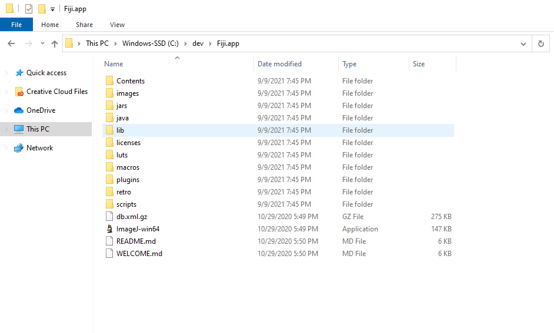
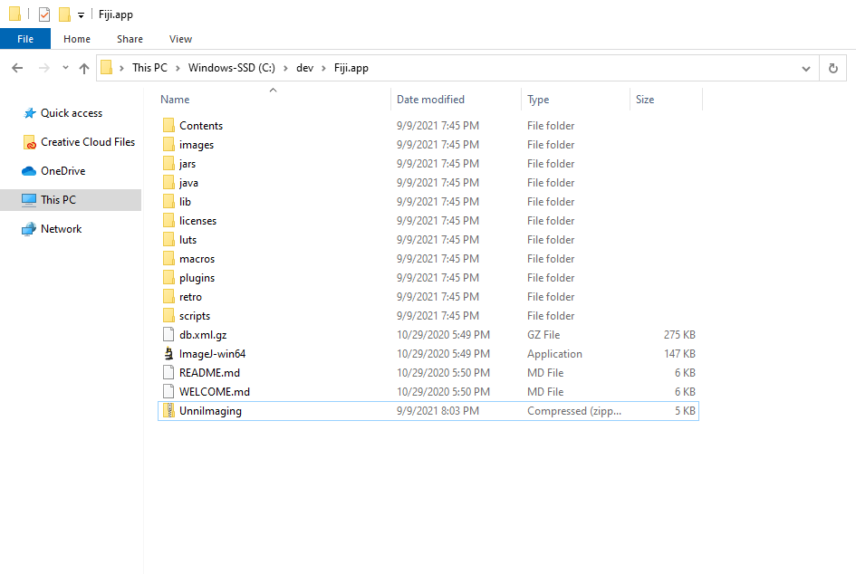
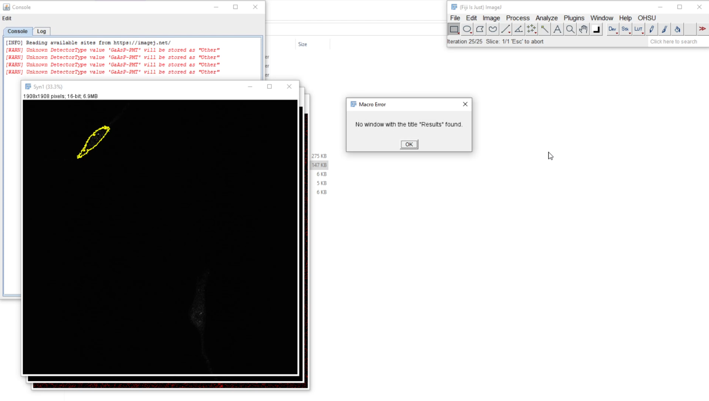

# OHSU Unni Lab Scripting

Repository with python scripts for Fiji used in OHSU Unni Lab. 

# Getting started

## Prereq: Fiji

Download Fiji from https://imagej.net/software/fiji/downloads

Move/Unzip Fiji wherever you want

You should now have a Fiji.app folder on your system, within which is the ImageJ executable file (to run the ImageJ program), and folders like `scripts` and `jars`



## Adding UnniImaging

Download the latest release by going to https://github.com/pvlaraia/ohsu_lab/releases and downloading the UnniImaging.zip file from the most recent release
Place the UnniImaging.zip file inside of the Fiji.app folder (see pre-reqs) ie place UnniImaging.zip alongside the ImageJ exe file. 



Now unzip/extract the contents of UnniImaging.zip. That's going to add files to the existing `scripts` & `jars` folders. To confirm that this worked, you should see an ohsu folder in both `scripts` and `jars/Lib`


# Run Imaging

## Run

Open ImageJ, and you should see a new option in the title bar labeled 'OHSU' (next to 'Window' and 'Help'). Select `OHSU -> Run Imaging` to run the test, and follow the prompts. It'll ask for an input folder (The folder containing the images you intend to procss), and an output folder (where the results will be saved)


## Config

In the `scripts/OHSU` folder is a `config.json` file. Open this file in a text editor (editing with Notepad in Windows for example) in order to tweak the channels
for the imaging that's going to be run. The default values are:

```
{
  "channels": {
    "1": "Syn1",
    "2": "gH2AX",
    "3": "DAPI"
  },
  "mainChannel": "3",
  "colocChannel": "1"
}
```

which means we have 3 channels in the image. Channel 1 is 'Syn1', Channel 2 is 'gH2AX', Channel 3 is "DAPI". 

mainChannel "3" means the DAPI is what our main channel is for which we're going to be grabbing the threshold

colocChannel "1" means Syn1 is the focus of colocalisation

If one wanted to change this based on an experiment where Syn1 is the mainChannel and we don't have colocalisation, the config file would become

```
{
  "channels": {
    "1": "Syn1",
    "2": "SomeMarker"
  },
  "mainChannel": "1"
}
```

NOTE: It's important that there are no trailing commas in the json file. You can use a text editor with JSON formatting/syntax checking to avoid these kinds of issues

# Colocalisation Test "Results Window" bugfix

If you try to run the script on multiple images, and on the attempt to process the 2nd of n images, you see an error that says 'Results window not found' or something along those lines, you've encountered a bug in the default Colocalisation Test plugin. 



In order to fix that, you can go to https://github.com/pvlaraia/Colocalisation_Analysis/releases

Download the .jar file in the most recent release, and follow the instructions to replace the existing Colocalisation Test jar file in the `plugins` folder


